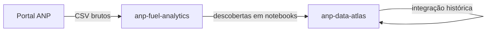

# anp-fuel-analytics

Monorepo de **análises exploratórias** sobre dados abertos de combustíveis da ANP. Aqui testamos hipóteses, perfilamos colunas e validamos qualidade — o que for estável e útil para outros projetos **volta documentado** no [anp-data-atlas](https://github.com/GabrielTrentino/anp-data-atlas).

## Objetivo

Executar estudos reproduzíveis (notebooks + pipelines) que respondem: *como são os dados na prática?* — antes de construir integração histórica ou produtos analíticos.

| Este repositório (`anp-fuel-analytics`) | [anp-data-atlas](https://github.com/GabrielTrentino/anp-data-atlas) |
|----------------------------------------|---------------------------------------------------------------------|
| **Exploração** — perfil, categorias, duplicatas, séries piloto | **Referência** — catálogo, metadados, dicionário, matriz de arquivos |
| Notebooks e pipelines de transformação | **Integração histórica** — pipeline que consolida a série no tempo |
| Descobertas alimentam o atlas (seções novas no `.md`) | Documentação permanente para quem for integrar ou analisar |

Dados em `data/` são **locais e não versionados**. Versionamos código, notebooks, SQL e READMEs dos estudos.

## Estudos

| Estudo | Slug | Foco |
|--------|------|------|
| Tancagem do Abastecimento Nacional | [tancagem-abastecimento](estudos/tancagem-abastecimento/) | raw → trusted → refined |

Configuração compartilhada entre estudos: [`config/monorepo.yaml`](config/monorepo.yaml).

## Estrutura

```
anp-fuel-analytics/
├── config/
│   └── monorepo.yaml              # estudos, caminhos e etapas do pipeline
├── pipelines/
│   ├── run.py                     # orquestrador: py pipelines/run.py <slug> [step]
│   ├── core/                       # config + executor SQL (DuckDB)
│   ├── python/                    # etapas RAW (download, prepare)
│   └── sql/{slug}/                # etapas TRUSTED e REFINED
├── data/                          # local — não versionado
│   ├── raw/{slug}/
│   ├── trusted/{slug}/
│   └── refined/{slug}/
├── estudos/{slug}/
│   ├── README.md
│   └── notebooks/
├── requirements.txt
└── README.md
```

## Ambiente

```bash
py -3 -m venv .venv
.venv\Scripts\activate
pip install -r requirements.txt
jupyter lab
```

## Pipeline (ex.: tancagem)

Na raiz do repositório:

```bash
# Todas as etapas
py pipelines/run.py tancagem-abastecimento

# Uma etapa
py pipelines/run.py tancagem-abastecimento trusted
```

| Etapa | Engine | Saída principal |
|-------|--------|-----------------|
| `raw` | Python | `data/raw/tancagem-abastecimento/` |
| `raw_prepare` | Python | CSV derivados (ex.: out/2022 XLSX) |
| `trusted` | SQL | `data/trusted/.../tancagem.parquet` |
| `trusted_uf` | SQL | `data/trusted/.../uf/{GO,TO,DF}.parquet` |
| `refined` | SQL | `data/refined/.../tancagem_por_mes_uf_grupo_tag.parquet` |

## Fluxo com o atlas



## Licença

[MIT](LICENSE) — código. Dados ANP: termos da agência.

https://github.com/GabrielTrentino/anp-fuel-analytics
