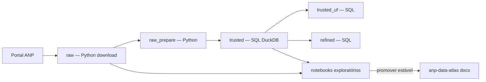
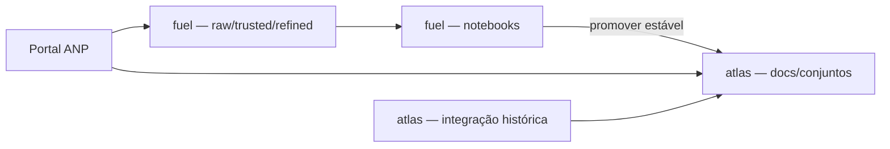

# anp-fuel-analytics

Monorepo de **análises exploratórias** sobre dados abertos de combustíveis da ANP. Aqui testamos hipóteses, perfilamos colunas e validamos qualidade — o que for estável e útil para outros projetos **volta documentado** no [anp-data-atlas](https://github.com/GabrielTrentino/anp-data-atlas).

## Objetivo

Executar estudos reproduzíveis (notebooks + pipelines) que respondem: *como são os dados na prática?* — antes de construir integração histórica ou produtos analíticos.

| Este repositório (`anp-fuel-analytics`) | [anp-data-atlas](https://github.com/GabrielTrentino/anp-data-atlas) |
|----------------------------------------|---------------------------------------------------------------------|
| **Exploração** — perfil, categorias, duplicatas, séries piloto | **Referência** — catálogo, metadados, dicionário, matriz de arquivos |
| Notebooks e pipelines de transformação | **Integração histórica** — pipeline que consolida a série no tempo |
| Descobertas alimentam o atlas (seções novas no `.md`) | Documentação permanente para quem for integrar ou analisar |

Dados em `data/` são **locais e não versionados**. Versionamos código, notebooks, SQL e READMEs dos estudos.

## O que cada repositório guarda

| Conteúdo | **anp-fuel-analytics** (este repo) | **[anp-data-atlas](https://github.com/GabrielTrentino/anp-data-atlas)** |
|----------|-----------------------------------|--------------------------------------------------------------------------|
| Metadados oficiais ANP | Link para o atlas | Sim — `docs/conjuntos/` |
| Matriz de URLs e lacunas do portal | Referência ao atlas | Sim |
| Inventário empírico dos brutos (linhas, m³, `Data` por arquivo) | Notebooks (ex.: `01_perfil_exploratorio`) | Promovido quando estável |
| Schema confirmado na prática | Tabelas e código nos notebooks | Resumo em Markdown |
| Chave candidata, regras de agregação | Validação exploratória | Documentação de integração |
| Anomalias em investigação | `TODO.md` do estudo | Achados confirmados |
| Gráficos, `describe()`, experimentos | Sim | Não |
| Camadas raw / trusted / refined | Sim — `pipelines/` | Não |
| Pipelines de integração histórica | Protótipos por estudo | Série consolidada documentada |

**Fluxo:** explorar aqui → promover findings estáveis para `docs/conjuntos/{slug}.md` no atlas. O atlas é o manual de integração; este repo é o laboratório que o alimenta.

## Fluxo de processamento

Pipeline local por estudo (ex.: tancagem), orquestrado por [`config/monorepo.yaml`](config/monorepo.yaml) e `pipelines/run.py`:



| Etapa | Engine | Entrada | Saída |
|-------|--------|---------|-------|
| `raw` | Python | URLs ANP | `data/raw/{slug}/` |
| `raw_prepare` | Python | XLSX legados (ex. out/2022) | CSV em `data/raw/` |
| `trusted` | SQL | `data/raw/**/*.csv` | `data/trusted/{slug}/tancagem.parquet` |
| `trusted_uf` | SQL | trusted | `data/trusted/{slug}/uf/{UF}.parquet` |
| `refined` | SQL | trusted | `data/refined/{slug}/*.parquet` |

```bash
py pipelines/run.py tancagem-abastecimento          # todas as etapas
py pipelines/run.py tancagem-abastecimento trusted  # uma etapa
```

**RAW** permanece em Python (download e preparação). **TRUSTED** e **REFINED** usam arquivos `.sql` em `pipelines/sql/{slug}/`, executados via DuckDB com variáveis `{{RAW_DIR}}`, `{{TRUSTED_PARQUET}}`, etc.

## O que promover para o atlas (e o que não)

### Promover (sim)

| Tipo | Exemplo | Destino no atlas |
|------|---------|------------------|
| Inventário por arquivo | linhas e m³ por `2025/janeiro.csv` | Inventário empírico |
| Chave sem duplicatas | `Data` + `CodInstalacao` + `Tag` + `GrupoDeProdutos` | Qualidade e chaves |
| Tipos reais observados | `Cnpj` como string, não float | Estrutura dos arquivos |
| Domínios categóricos | 11 `Segmento`, 4 `GrupoDeProdutos` | Estrutura / qualidade |
| Anomalia documentada | nov/dez 2022 −44% m³ vs jun–out | Anomalias conhecidas |
| Regra de soma | agregar `TancagemM3` na granularidade da chave | Qualidade e chaves |

### Não promover (manter aqui)

| Tipo | Exemplo | Onde ficar |
|------|---------|------------|
| Notebook completo | `01_perfil_exploratorio.ipynb` | `estudos/{slug}/notebooks/` |
| Gráficos e rankings | evolução GO vs SP | Notebook |
| TODO / hipótese | escopo `tancagem_terminais_*` em 2022 | `estudos/{slug}/TODO.md` |
| SQL e orquestrador | `trusted.sql`, `run.py` | `pipelines/` |
| Parquets locais | `tancagem.parquet` | `data/` (gitignored) |

### Critérios (checklist)

Antes de editar o atlas, confira:

1. **Reproduzível** — resultado verificável nos CSVs brutos ou no trusted.
2. **Útil para integração** — ETL, chaves, lacunas, armadilhas de nomenclatura.
3. **Estável** — revisado; não é rascunho de célula em andamento.
4. **Referenciável** — cite notebook (`01_perfil…`), arquivo fonte e data do snapshot.

Se ainda estiver em investigação, use `TODO.md` e promova só quando fechar.

## Estudos

| Estudo | Slug | Foco |
|--------|------|------|
| Tancagem do Abastecimento Nacional | [tancagem-abastecimento](estudos/tancagem-abastecimento/) | raw → trusted → refined |

Configuração compartilhada entre estudos: [`config/monorepo.yaml`](config/monorepo.yaml).

## Estrutura

```
anp-fuel-analytics/
├── config/
│   └── monorepo.yaml              # estudos, caminhos e etapas do pipeline
├── pipelines/
│   ├── run.py                     # orquestrador: py pipelines/run.py <slug> [step]
│   ├── core/                       # config + executor SQL (DuckDB)
│   ├── python/                    # etapas RAW (download, prepare)
│   └── sql/{slug}/                # etapas TRUSTED e REFINED
├── data/                          # local — não versionado
│   ├── raw/{slug}/
│   ├── trusted/{slug}/
│   └── refined/{slug}/
├── estudos/{slug}/
│   ├── README.md
│   └── notebooks/
├── requirements.txt
└── README.md
```

## Ambiente

```bash
py -3 -m venv .venv
.venv\Scripts\activate
pip install -r requirements.txt
jupyter lab
```

## Pipeline (ex.: tancagem)

Detalhes das etapas na seção [Fluxo de processamento](#fluxo-de-processamento) acima.

| Etapa | Engine | Saída principal |
|-------|--------|-----------------|
| `raw` | Python | `data/raw/tancagem-abastecimento/` |
| `raw_prepare` | Python | CSV derivados (ex.: out/2022 XLSX) |
| `trusted` | SQL | `data/trusted/.../tancagem.parquet` |
| `trusted_uf` | SQL | `data/trusted/.../uf/{GO,TO,DF}.parquet` |
| `refined` | SQL | `data/refined/.../tancagem_por_mes_uf_grupo_tag.parquet` |

## Fluxo com o atlas

Complemento ao [fluxo de processamento](#fluxo-de-processamento) local — relação entre os dois repositórios:



O atlas documenta **o quê** integrar; o fuel-analytics prova **como** e gera camadas locais para análise.

## Licença

[MIT](LICENSE) — código. Dados ANP: termos da agência.

https://github.com/GabrielTrentino/anp-fuel-analytics
