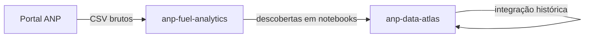

# anp-fuel-analytics

Monorepo de **análises exploratórias** sobre dados abertos de combustíveis da ANP. Aqui testamos hipóteses, perfilamos colunas e validamos qualidade — o que for estável e útil para outros projetos **volta documentado** no [anp-data-atlas](https://github.com/GabrielTrentino/anp-data-atlas).

## Objetivo

Executar estudos reproduzíveis (notebooks + scripts leves) que respondem: *como são os dados na prática?* — antes de construir integração histórica ou produtos analíticos.

| Este repositório (`anp-fuel-analytics`) | [anp-data-atlas](https://github.com/GabrielTrentino/anp-data-atlas) |
|----------------------------------------|---------------------------------------------------------------------|
| **Exploração** — perfil, categorias, duplicatas, séries piloto | **Referência** — catálogo, metadados, dicionário, matriz de arquivos |
| Notebooks e protótipos de transformação | **Integração histórica** — pipeline que consolida a série no tempo (raw → série utilizável) |
| Descobertas alimentam o atlas (seções novas no `.md`) | Documentação permanente para quem for integrar ou analisar |

Dados em `data/` são **locais e não versionados**. Versionamos código, notebooks e READMEs dos estudos.

## Estudos

| Estudo | Pasta | Foco exploratório |
|--------|-------|-------------------|
| Tancagem do Abastecimento Nacional | [estudos/tancagem-abastecimento/](estudos/tancagem-abastecimento/) | Perfil, chave lógica, piloto temporal |

## Estrutura

```
anp-fuel-analytics/
├── data/                              # local — não versionado
│   └── raw/{slug}/
├── estudos/{slug}/
│   ├── README.md
│   ├── pipelines/                     # download e protótipos de ETL
│   └── notebooks/                     # análises exploratórias
├── requirements.txt
└── README.md
```

## Ambiente

```bash
py -3 -m venv .venv
.venv\Scripts\activate
pip install -r requirements.txt
jupyter lab
```

Tancagem — raw + trusted:

```bash
py estudos/tancagem-abastecimento/pipelines/download_raw.py
py estudos/tancagem-abastecimento/pipelines/build_trusted.py
```

Camadas locais: `data/raw/{slug}/` → `data/trusted/{slug}/` (parquet unificado).

## Fluxo com o atlas



## Licença

[MIT](LICENSE) — código. Dados ANP: termos da agência.

https://github.com/GabrielTrentino/anp-fuel-analytics
